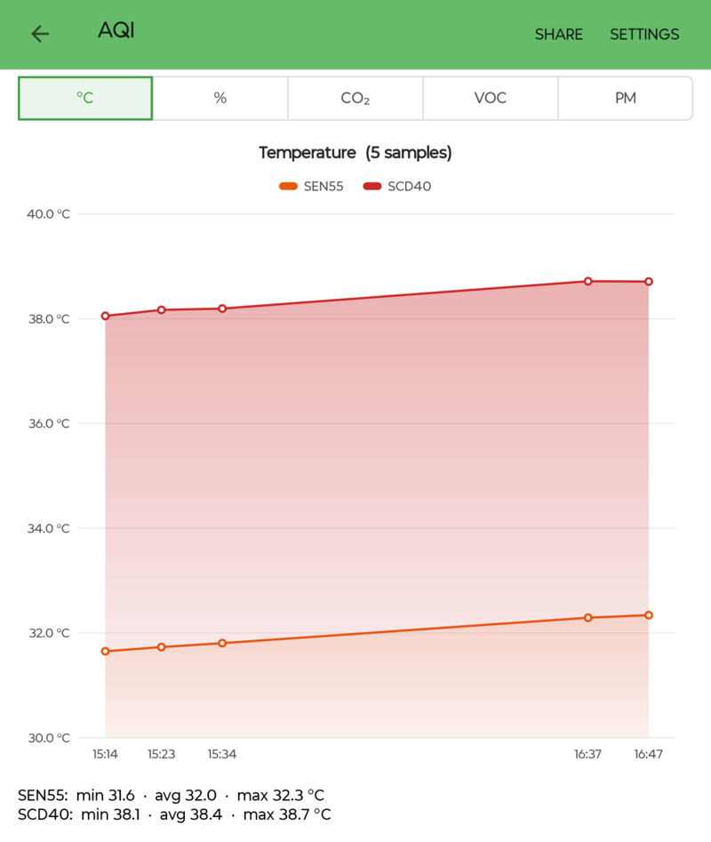
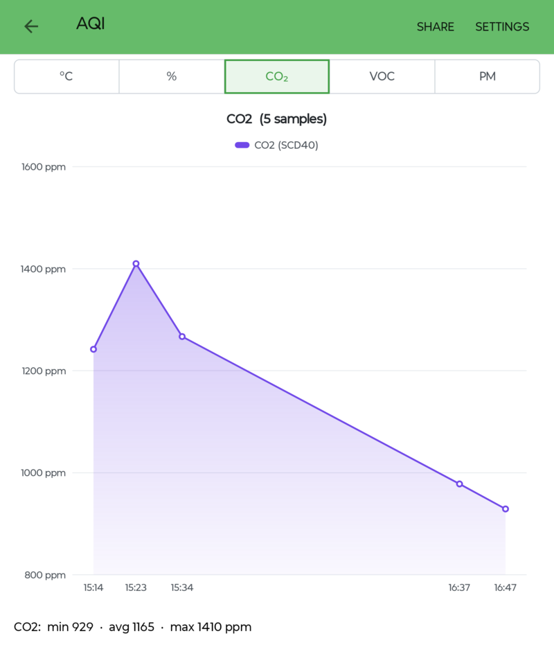
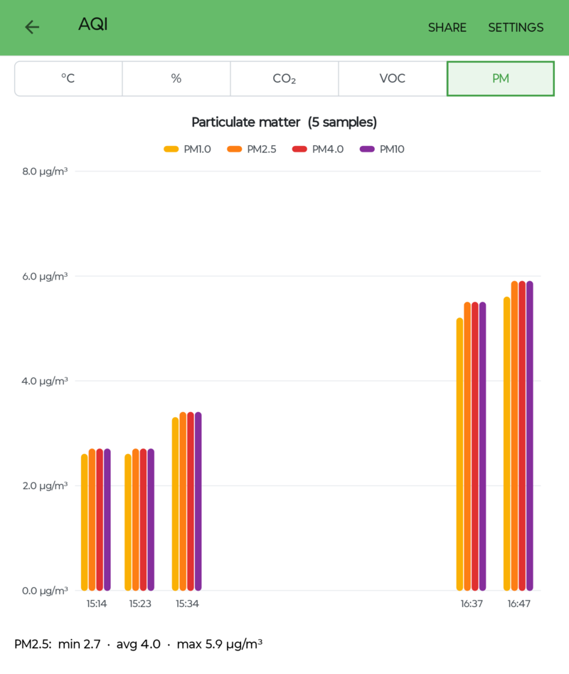

# Sensor_Dashboard_Android

The Android version of [Sensor_Dashboard](https://github.com/Kongduino/Sensor_Dashboard): environment readings and positions from a Meshtastic MQTT feed, a Meshtastic node on your network, and an M5Stack air-quality monitor (AQI), charted and mapped on a phone or tablet.

It's written in Xojo, with no plugins and no external libraries. The Meshtastic and MQTT parts use the [MQTT_Xojo](https://github.com/Kongduino/MQTT_Xojo) library (in `Library/`), and the data, chart and map code is shared with the desktop app (in `Shared/`).

## Screenshots

An M5Stack AQI device on a tablet: the temperature of its two sensors, CO₂, and particulate matter as bars. Under each chart, min / avg / max.

<p>
  
  
  
</p>

## Contents

- [Screenshots](#screenshots)
- [What it does](#what-it-does)
- [Requirements](#requirements)
- [Getting started](#getting-started)
- [Sources](#sources)
- [Screens](#screens)
- [Sharing](#sharing)
- [Where things are kept](#where-things-are-kept)
- [Repository layout](#repository-layout)
- [Notes on Xojo for Android](#notes-on-xojo-for-android)
- [Limitations](#limitations)
- [License](#license)

## What it does

- **Three sources**, each with its own card on the Home screen and an on/off switch:
  - a **Meshtastic MQTT feed** (the packets one gateway uploads), decrypted with your channel keys
  - a **Meshtastic node** on your network, over TCP (port 4403)
  - an **M5Stack AQI** device, through M5Stack's ezdata service
- **Charts** with a time axis and a fitted Y axis: temperature, humidity and pressure; the radio (RSSI / SNR) of an MQTT feed, for packets the gateway heard directly (a relayed packet's values describe the last relay, so only its hop count is kept); CO2, VOC and particulate matter (as bars) for the AQI. Tap a chart, or slide along it, to read a sample's values.
- **A map** of a node's positions on OpenStreetMap: drag, pinch, double-tap, and the +/−/Fit buttons; tap a point for its time, coordinates, altitude, satellites and reception.
- **Storage** in a local SQLite database, so the charts start with earlier readings.
- **Sharing**: the readings (CSV), the positions (CSV and GPX) and the chart or map (PNG), through Android's share sheet.

## Requirements

- Xojo **2026r2.1** with Android support, to build it.
- Android 9 (API 28) or later. Tested on a tablet with Android 16.
- For the sources: an MQTT broker your gateway publishes to, a Meshtastic node reachable on your network, or an M5Stack AQI device registered with ezdata.

## Getting started

1. Open `Sensor_Dashboard_Android.xojo_project` in Xojo and run it on a device or an emulator.
2. On the Home screen, tap a card that says **set up: tap here**, fill in its settings, and **Save**.
3. Turn the card's switch on. The card turns green when connected and shows the latest reading.
4. Tap a card to open its charts.

A source that was on when you left the app starts again the next time you open it.

## Sources

| Source | Settings | Notes |
|---|---|---|
| **MQTT feed** | broker (`host` or `host:port`), root topic (for example `msh/EU_868`), the gateway's node ID (`!aabbccdd`), user and password, channel keys, an optional single node, TLS | Subscribes to `<root topic>/2/e/+/!<gateway>`, as the desktop app does. The root topic is the prefix only, without `#` or `+`. Channel keys: `Name=base64` entries separated by `;`; a key without a name is used for the other channels; empty means the default key (`AQ==`). |
| **Meshtastic node** | address, port (4403) | A node accepts one TCP client at a time: close the Meshtastic app (or anything else connected to the node) first. The node's own sensor is charted by default; any node it knows can be picked. |
| **M5Stack AQI** | the device ID (12 hex digits) | Polled at the device's own interval (at most every minute). |

## Screens

- **Home**: one card per source, with its state (green connected, orange connecting or retrying, grey off, red a problem), what it follows, its latest reading, and its switch.
- **Source screen**, opened from a card:
  - **Node**: a filter and a node picker; tabs °C, %, hPa, Map; **Request** asks the selected node for its readings (on the Map tab, its position). Nodes that have nothing new answer `NO_RESPONSE`, which the status line shows.
  - **MQTT**: tabs °C, %, hPa, RSSI (RSSI and SNR), Map.
  - **AQI**: tabs °C and % (both sensors, SEN55 and SCD40), CO₂, VOC, PM.
  - The tabs share the screen's width, so they fit on a phone as well as a tablet.
  - **Settings** in the toolbar opens the source's settings.
- The screen stays on while a source is on: the app collects data only while it's in the foreground.

## Sharing

**Share** on a source screen writes, then offers through Android's share sheet:

- `<source>.csv`: every stored reading of what the screen shows, in the same columns as the desktop export
- `<source>_positions.csv` and `.gpx`: the positions (node and MQTT), when there are any
- `<source>_<tab>.png`: the current chart or map, at twice the screen size

Several files are shared as one zip.

## Where things are kept

All in the app's own storage, readable by the app only:

| What | Where |
|---|---|
| Settings (including the MQTT password and channel keys) | `settings.json` in the app's files folder |
| Readings and positions | `records.sqlite`, next to it |
| Event log of the last run | `Event_Log.txt`, next to it |
| Map tiles | the app's cache folder (`tiles/`); Android may clear it, and they come back |

Uninstalling the app removes all of them.

## Repository layout

```
Sensor_Dashboard_Android.xojo_project   the project (open this in Xojo)
App.xojo_code                 the app: back in the foreground, the sources catch up
Hub.xojo_code                 the app's state: settings, database, the three sources
MQTTSource.xojo_code          the MQTT feed
NodeSource.xojo_code          a Meshtastic node over TCP
AQISource.xojo_code           an M5Stack AQI device
HomeScreen.xojo_code          the cards and switches
SourceCard.xojo_code          one card (a canvas)
SourceScreen.xojo_code        a source's tabs, charts, map, Request and Share
SettingsScreen.xojo_code      a source's settings
MobileSensorChart.xojo_code   the chart control (touch)
MobileMapView.xojo_code       the map control (touch, pinch)
TabStrip.xojo_code            the tab bar (tabs share its width)
Icons/                        the app icon: PNGs and their SVG sources
Shared/                       the code shared with the desktop app, kept identical to Sensor_Dashboard/Shared
Library/                      MQTT_Xojo's library, kept identical to MQTT_Xojo/Library
LICENSE                       GPL-3.0
```

`Shared/` and `Library/` are copies: changes go to the desktop app and to MQTT_Xojo first, then are copied here.

## Notes on Xojo for Android

Xojo translates Android projects to Kotlin, and some code that's fine on desktop compiles or runs differently there. The shared code follows these rules:

- Binary Strings: after a concatenation a String is tagged UTF-8, so byte functions miscount bytes 128–255. The library keeps binary data tagged one byte per character (`MeshBin`) and decodes text with `MeshUTF8Text`.
- No `Crypto.AESDecrypt`: AES-CTR is done in plain Xojo (`MeshAESCTRXojo`). No `Join`, `StrComp`, `SerialConnection`, or `SpecialFolder.ApplicationData`.
- `Format` treats a `-` in the mask as text: signed numbers go through `FormatValue`. `Val("&H…")` gives 0 and `Hex()` keeps 32 bits: `HexValue` and `HexText`.
- A missing or null JSON value can't be put in a JSONItem (it throws): `ChildObject`. A MemoryBlock function never returns Nil.
- GraphicsPath shapes ignore `Graphics.ScaleX/ScaleY`: the painters scale them by hand in exports.
- A screen's Functions can't be called from its `Opening` event; controls aren't moved or resized at run time.
- Files to share go under `SpecialFolder.Temporary/images/` (the template's FileProvider root); `ShareFile` with an array doesn't compile, so several files are zipped.

## Limitations

- The app collects data only while it's on screen (no background service).
- No USB connection to a node (Xojo for Android has no serial port).
- MQTT TLS encrypts the connection but doesn't verify the broker's certificate (Xojo's SSLSocket).
- Sharing several files gives one zip.

## License

GPL-3.0, like Sensor_Dashboard and MQTT_Xojo. See [LICENSE](LICENSE).

It includes the [MQTT_Xojo](https://github.com/Kongduino/MQTT_Xojo) library (`Library/`) and the code shared with [Sensor_Dashboard](https://github.com/Kongduino/Sensor_Dashboard) (`Shared/`), both GPL-3.0.
